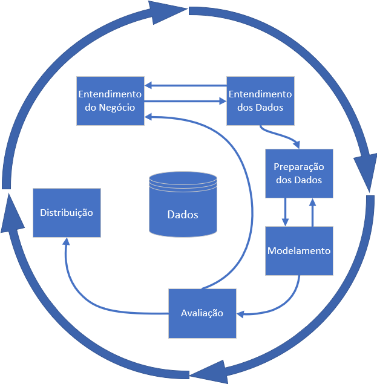
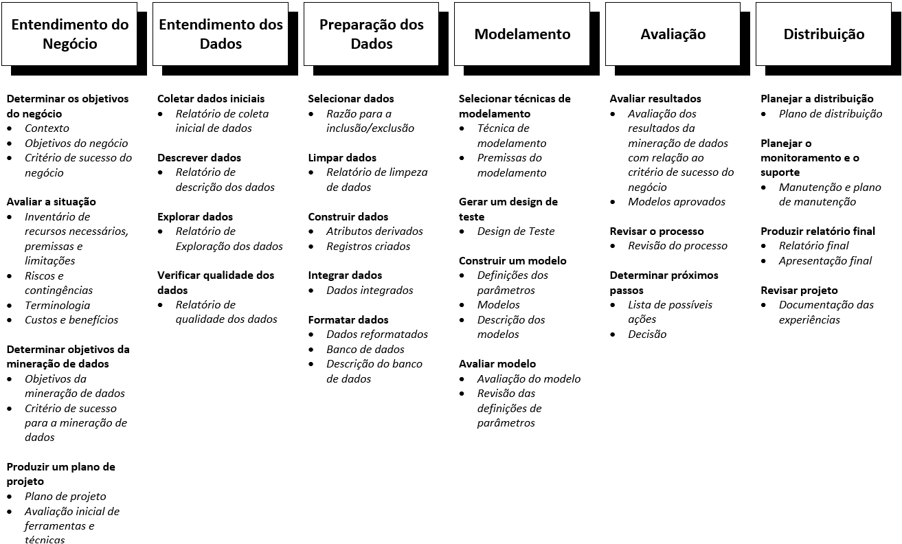

# Projeto - Leishmaniose no Brasil
# Project - Leishmaniose in Brazil

Integrantes do grupo

Nome                     | RA    | Especialização
-------------------------| ------| --------------
Carolina Muller Ferreira |210904 | Saúde
Letícia Moreno           |235497 | Saúde
Lucas Feliciano da Silva |182487 | TI 
Paulo Victor             |224943 | TI

## Histórico - mudança de tema

Para a disciplina de Visualização de dados na saúde inicialmente escolhemos o tema HIV, buscando a prevalência de HIV no Brasil. Porém ao visualizar os possíveis banco de dados cuja fonte principal era os dados do SINAN (Sistema de Informação de Agravos de Notificação), observamos que não há disponível os dados brutos de HIV no SINAN para download, portanto resolvemos mudar de tema e escolher um tema que estivesse os dados disponíveis para download na plataforma do SINAN/Datasus. Dessa forma o novo tema é Lesihmaniose, e o objetivo desse trabalho é avaliar a prevalência de Leishmaniose no Brasil.

Nota: o README do HIV consta nesse github para consulta, mostrando o histórico e o que foi observado. Ele consta na pasta: data4health/assets/docs. 

## Vídeo - Leishmaniose

https://user-images.githubusercontent.com/81878392/117465417-0efdd180-af28-11eb-84a1-64b5e11d17cd.mp4

## Descrição Resumida do Projeto

   
      
## Perguntas da Pesquisa 
 
Letra/significado            | Correlação    
-----------------------------| ------
P (pessoa/pessoas)           | brasileiros adultos
I (intervenção)              | não temos
C (comparativo ou comparador)| não temos
O (desfecho a se avaliar)    | Leishmaniose
S (tipo de estudo)           | prevalência de adultos brasileiro com Leishmaniose nas últimas décadas e categorização por sexo e idade.

Perguntas para nosso projeto:
Qual a prevalência de adultos com Leishmaniose no Brasil nas últimas décadas? E por idade, sexo, região?
         
## Metodologia
### Aspectos gerais
A metodologia que será utilizada para extrair conhecimento dos bancos de dados escolhidos é a CRISP-DM. Esta técnica de processamento de dados consiste em 6 fases: Entendimento do Negócio, Entendimento dos Dados, Processamento dos Dados, Modelamento, Avaliação e Entrega/Distribuição do Projeto. Essas etapas são iterativas, cíclicas e podem ser mais detalhadas à medida que o projeto avança, contendo tarefas que partem do âmbito geral até o mais específico, evoluindo no decorrer do projeto.  

Seguindo o modelo de referência do CRISP-DM 1.0, e analisando o andamento do projeto podemos dizer que a etapa atual do projeto está entre a etapa de Entendimento do Negócio e a etapa de Entendimento dos Dados uma vez que as perguntas do projeto já foram feitas e o banco de dados principal já foi escolhido, atualmente estão sendo feitos os processos de descrição e exploração dos dados.  Vale notar que, devido a característica cíclica do CRISP-DM, essas etapas e processos não são fixos podendo ser reformulados caso seja necessário, outra observação importante é que algumas das tarefas gerais de algumas etapas não se aplicam, como por exemplo a tarefa Manutenção e plano de manutenção na etapa de Distribuição.

**Imagem 1:** - CRISP-DM e suas etapas

**Imagem 2:** - CRISP-DM e suas etapas detalhadas, em negrito as tarefas gerais e em itálico seus respectivos resultados.

## Bases de dados e Evolução
### Bases não adotadas

Base de dados         |Endereço da Web                                                                                         | Resumo descritivo                         
----------------------|--------------------------------------------------------------------------------------------------------|------------------------------------------
Inquéritos nacionais  |https://www.ibge.gov.br/estatisticas/sociais/saude.html                                                 |Pesquisas nacionais do IBGE
Global Burden Disease |http://www.healthdata.org/search?search_terms=leishmaniasis+                                            |Pesquisa global sobre saúde 
Estatísticas do sécXX |https://seculoxx.ibge.gov.br/populacionais-sociais-politicas-e-culturais/busca-por-palavra-chave/saude  |Estatísticas do séc XX do IBGE sobre saúde 
TABNET Datasus        |http://tabnet.datasus.gov.br/cgi/deftohtm.exe?sinannet/cnv/leishvbr.def                                 |Plataforma do DATAUSUS - leish. visceral
TABNET Datasus        |http://tabnet.datasus.gov.br/cgi/tabcgi.exe?sinannet/cnv/ltabr.def                                      |Plataforma do DATAUSUS - leish. tegumentar

Base de dados         |Motivo de exclusão                       
----------------------|--------------------------------------------------------------------------------------------------------
Inquéritos nacionais  |Pesquisas nacionais - Não contém dados específicos de Leishmaniose, e algumas pesquisas não tiveram uma edição atual, exemplo os censos            
Global Burden Disease |Países fornecem os dados globais, mas não contém os dados brutos originais -  iremos usar de comparativos e na discussão
Estatísticas do sécXX |Contém as estatísticas de leishmaniose de 1959 até  2000 - sem dados recentes 
TABNET Datasus        |Contém os dados de Leishmaniose porém a fonte dos dados é o SINAN, assim o correto é utilizar os dados direto da fonte - leish. visceral
TABNET Datasus        |Contém os dados de Leishmaniose porém a fonte dos dados é o SINAN, assim o correto é utilizar os dados direto da fonte - leish. tegumentar

Portanto como esses possíveis fontes de dados não foram aplicáveis a análise, não foi necessário realizar nenhuma análise descritiva pois de imediato já forma descartados, seja por não conter os dados que queriamos ou por ter dados secundário de um outra fonte primária de dados. Nesse ultimo caso a fonte primária de dados foi incluida como fonte principal para análise dos dados.

### Bases adotadas

Base de dados            |Endereço da Web                                                                                         | Resumo descritivo                           
-------------------------|--------------------------------------------------------------------------------------------------------|-----------------------------------------
SINAN                    |https://datasus.saude.gov.br/transferencia-de-arquivos/#                                                |Sistema de Informação de Agravos de                                                                                                                                              Notificação
Estimativas da População |https://www.ibge.gov.br/estatisticas/sociais/populacao/9103-estimativas-de-populacao.html?=&t=downloads |Estimativas do total da população por ano   
População - censo        |https://www.ibge.gov.br/estatisticas/sociais/populacao/9662-censo-demografico-2010.html?=&t=resultados  |Estimativas do total da população por censo
    
Base de dados           |Motivo de exclusão                       
------------------------|--------------------------------------------------------------------------------------------------------
SINAN                   |Contém todos os dados do Brasil por ano, sexo e região. São dados de notifcação compulsória. 
Estimativas da População|Contém dados da população em geral por ano para calculo de prevalência 
População - censo       |Contém dados da população em 2010 para calculo de prevalência

Portanto a fonte primária de dados será os dados do SINAN, e utilizaremos os dados de população do IBGE para avaliar a prevalência por ano. Como os bancos de dados de Leishmaniose Visceral e Leishmaniose Tegumentar são bem extensos por vários anos, resolvemos focar nos ultimos 5 anos queu são dados mais recentes da população brasileira.

Os bancos de dados do SINAN são baixados por ano, por estado e por patologia, no nosso caso Leishmaniose visceral e tegumentar, totalizando 227 download de bancos indiviadualizados.

## Ferramentas

Software Phyton/Orange - Categorização dos dados, análise estatísticas, variabilidade dos dados, classificação e análise da distribuição/correlação  
Software STATA 14.2 - análise de prevalência

## Cronograma

Etapa (s)                                  | Data (s)
------------------------------------------ | ------
Entrega do Plano do Projeto - E1           | 13/abril
Trabalhamos com HIV                        | 19 a 23/abril
Trabalhamos com HIV                        | 26 a 30/abril
Mudança de tema - Leishmaniose 
e avaliação dos dados                      | 3 a 7/maio
Entrega da bases de dados de trabalho - E2 | 11/maio
Correções de erros e resultados            | 17 a 21/maio
Comparação com a literatura                | 24 a 28/maio
Embasamento teorico do trabalho final      | 31 a 04/junho
Montar a apresentação                      | 7 a 11/junho
Treinamento da apresentação                | 14 a 18/junho
Entrega Final e apresentações              | 24/junho

## Referências
Site, I.B.G.E. "Disponível em: http://bvs.saude.gov.br/dicas-em-saude/2085-leishmaniose" Acesso em May, 07 (2021).
Site, I.B.G.E. "Disponível em: https://www.ibge.gov.br/estatisticas/sociais/saude.html"  Acesso em April, 05 (2021).
CRISP-DM 1.0: Step-by-step mining guide, The CRISP-DM consortium, Agosto, 2000.
