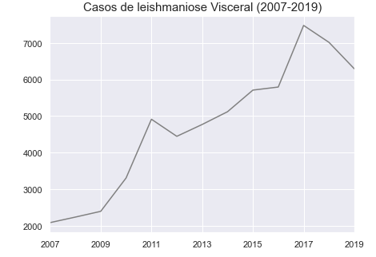
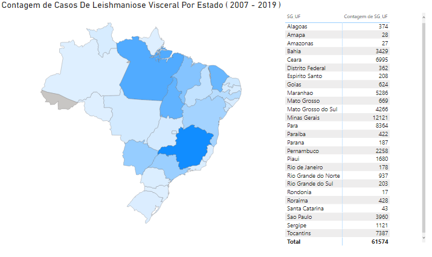
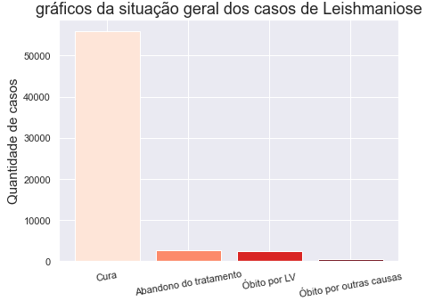
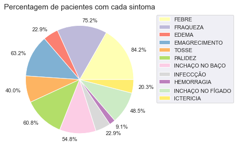
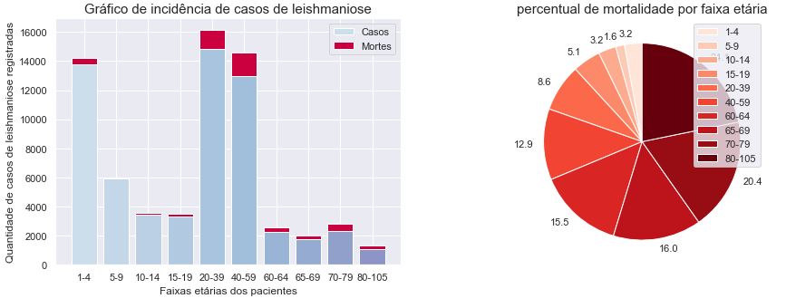
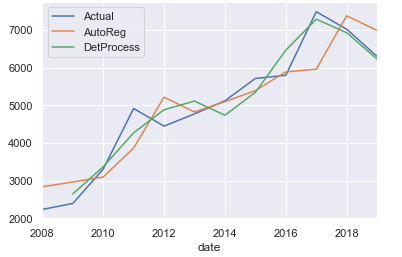
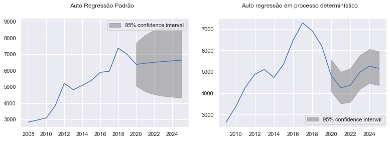

# Projeto - Leishmaniose no Brasil
# Project - Leishmaniose in Brazil

# Apresentação
O presente projeto foi originado no contexto das atividades da disciplina de pós-graduação Ciência e Visualização de Dados em Saúde, oferecida no primeiro semestre de 2021, na Unicamp.

Integrantes do grupo

Nome                     | RA    | Especialização
-------------------------| ------| --------------
Carolina Muller Ferreira |210904 | Saúde
Letícia Moreno           |235497 | Saúde
Lucas Feliciano da Silva |182487 | TI 
Paulo Victor             |224943 | TI

# Histórico - mudança de tema

Para a disciplina de Visualização de dados na saúde inicialmente escolhemos o tema HIV, buscando a prevalência de HIV no Brasil. Porém ao visualizar os possíveis banco de dados cuja fonte principal era os dados do SINAN (Sistema de Informação de Agravos de Notificação), observamos que não há disponível os dados brutos de HIV no SINAN para download, portanto resolvemos mudar de tema e escolher um tema que estivesse os dados disponíveis para download na plataforma do SINAN/Datasus. Dessa forma o novo tema é Lesihmaniose, e o objetivo desse trabalho é avaliar a prevalência de Leishmaniose no Brasil.

Nota: o README do HIV consta nesse github para consulta, mostrando o histórico e o que foi observado. Ele consta na pasta: data4health/assets/docs. 

# Descrição Resumida do Projeto

# Vídeos do Projeto

## Vídeo da Proposta
https://user-images.githubusercontent.com/81878392/117465417-0efdd180-af28-11eb-84a1-64b5e11d17cd.mp4

## Vídeo da Apresentação Final

# Slides do Projeto

## Slides da Proposta
https://docs.google.com/presentation/d/1jNVG5HN8Lp4eZ58-ug4YLRouo5puOsLnTsXeQ8nQ1OY/edit?usp=sharing

## Slides da Apresentação Final
https://docs.google.com/presentation/d/1EpiuwF6t2UUW529TDlQp-v0X-hM62SiLf0D2GpQ6xX4/edit?usp=sharing

# Introdução e Referenciais de Teóricos
As leishmanioses são antropozoonoses infectoparasitárias causadas por protozoários do gênero Leishmania sp, transmitidas por vetores flebotomíneos infectados, cujos hospedeiros definitivos são o homem e animais silvestres e domésticos quando estes têm contato com o ciclo de transmissão do parasito (1,2).
As lesões causadas pelas leishmanias podem ser cutâneas, mucocutâneas ou viscerais (3,4).
 A Leishmaniose Tegumentar Americana (LTA ou LT) é responsável por lesões cutâneas e/ou mucocutâneas nos hospedeiros, na qual costumam apresentar lesões pápulo-vesiculosas que podem ulcerar, formando lesões características da doença com ulcera crônica, com contornos regulares, aspecto purulento e indolores, que surgem no local de entrada do parasito (3,4).

A Leishmaniose Cutânea das Américas (LC) causam lesões infiltrativas na pele, do tipo nodular subcutâneo, na qual a pele e o tecido subcutâneo são envolvidos em ulcera única e geralmente indolor, de bordas elevadas e endurecidas, com fundo liso ou granuloso e secretante. O local de acometimento mais comum são as orelhas e apresenta caráter mutilante (3).

A Leishmaniose Visceral (LV) ocorre pela presença do parasito no interior de células fagocíticas mononucleares de órgãos viscerais, causando, principalmente, hepato e esplenomegalias, alterações de medula óssea, linfonodos e parede intestinal. Quando de caráter agudo, pode apresentar evolução fulminante se não controlada (3,4).

O tratamento das leishmanioses é extremamente hepatotóxico, fator pelo qual grande parte dos infectados pela doença optam pelo não-tratamento. O diagnóstico pode ser feito exames parasitológicos, imunológicos ou moleculares, tendo maior adesão aos testes imunológicos pelo baixo custo e rapidez de diagnóstico (3,4).

A Organização Mundial da Saúde (OMS) considera as leishmanioses como um sério problema de saúde pública no mundo e as inclui na classe das seis doenças prioritárias para o desenvolvimento de ações de controle. Isso se dá pela ocorrência da antropozoonose em 80 países, apresentar prevalência mundial de 12 milhões de casos, com cerca de 400 mil novos casos/ano (1).

Desde a descrição da LT no ano de 1909, a doença é notificada em vários municípios de todos os estados no Brasil, com média de 21.000 casos/ano e coeficiente de incidência de 8,6 casos/100.000 habitantes. Na região Norte do país a incidência é de 46,4 casos/100.000 habitantes, cerca de 5 vezes a mais que a incidência nacional (5). 

A incidência de casos de LV no Brasil é relativa a 90% dos casos registrados na Amárica Latina. A doença é descrita em diversos municípios do Brasil e apresenta mudanças no padrão de transmissão de ambientes rurais para ambientes urbanos. Há cerca de 3.500 casos/anuais e incidência de 2,0 casos/100.000 habitantes (6). 

O projeto tem como objetivo avaliar os bancos de dados do SINAN sobre os casos de Leishmaniose cutânea e visceral, avaliar as estatísticas de prevalência dos últimos 5 anos, categorizar os resultados e comparar os dados para a doença. 

Embora hoje tenhamos um sistema de notificação que faz esse acompanhamento e que a disponibilização de dados ocorra por meio de boletins epidemiológicos, nota-se pela ausência dos dados e por erros de digitação, que ainda temos muitas oportunidades de melhoria nesse sistema de notificação e que os boletins estão divulgando resultados por vezes não englobando várias variáveis como esse projeto realizou. E apesar de ser um assunto com muitas publicações, ainda dos muitos pilares citados nesse projeto não são justificados requerendo mais pesquisas para respondê-los.

# Estrutura do projeto

~~~
├── README.md          <- apresentação do projeto
│
├── data
│   ├── external       <- dados de terceiros
│   ├── interim        <- dados intermediários, e.g., resultado de transformação
│   ├── processed      <- dados finais usados para a modelagem
│   └── raw            <- dados originais sem modificações
│
├── notebooks          <- Jupyter notebooks ou equivalentes
│
├── src                <- fonte em linguagem de programação ou sistema (e.g., Orange)
│   └── README.md      <- instruções básicas de instalação/execução
│
└── assets             <- mídias usadas no projeto
~~~
   
# Perguntas da Pesquisa 
 
Letra/significado            | Correlação    
-----------------------------| ------
P (pessoa/pessoas)           | brasileiros adultos
I (intervenção)              | não temos
C (comparativo ou comparador)| não temos
O (desfecho a se avaliar)    | Leishmaniose
S (tipo de estudo)           | prevalência de brasileiros com Leishmaniose nas últimas décadas

Perguntas para nosso projeto:
Qual a prevalência de Leishmaniose no Brasil nos últimos 5 anos? 
É possível uma categorização dos resultados por cura e óbitos?

# Objetivos do Projeto
Objetivo deste trabalho é saber qual a prevalência de Leishmaniose no Brasil nos últimos 5 anos e quantos desses resultados é representado em cura e óbito.
         
# Metodologia
## Aspectos gerais
A metodologia que será utilizada para extrair conhecimento dos bancos de dados escolhidos é a CRISP-DM. Esta técnica de processamento de dados consiste em 6 fases: Entendimento do Negócio, Entendimento dos Dados, Processamento dos Dados, Modelamento, Avaliação e Entrega/Distribuição do Projeto. Essas etapas são iterativas, cíclicas e podem ser mais detalhadas à medida que o projeto avança, contendo tarefas que partem do âmbito geral até o mais específico, evoluindo no decorrer do projeto.  

Seguindo o modelo de referência do CRISP-DM 1.0, e analisando o andamento do projeto podemos dizer que a etapa atual do projeto está entre a etapa de Entendimento do Negócio e a etapa de Entendimento dos Dados uma vez que as perguntas do projeto já foram feitas e o banco de dados principal já foi escolhido, atualmente estão sendo feitos os processos de descrição e exploração dos dados.  Vale notar que, devido a característica cíclica do CRISP-DM, essas etapas e processos não são fixos podendo ser reformulados caso seja necessário, outra observação importante é que algumas das tarefas gerais de algumas etapas não se aplicam, como por exemplo a tarefa Manutenção e plano de manutenção na etapa de Distribuição. (5)

**Imagem 1:** - CRISP-DM e suas etapas

**Imagem 2:** - CRISP-DM e suas etapas detalhadas, em negrito as tarefas gerais e em itálico seus respectivos resultados.

# Bases de dados e Evolução
## Bases não adotadas

Base de dados         |Endereço da Web                                                                                         | Resumo descritivo                         
----------------------|--------------------------------------------------------------------------------------------------------|------------------------------------------
Inquéritos nacionais  |https://www.ibge.gov.br/estatisticas/sociais/saude.html                                                 |Pesquisas nacionais do IBGE
Global Burden Disease |http://www.healthdata.org/search?search_terms=leishmaniasis+                                            |Pesquisa global sobre saúde 
Estatísticas do sécXX |https://seculoxx.ibge.gov.br/populacionais-sociais-politicas-e-culturais/busca-por-palavra-chave/saude  |Estatísticas do séc XX do IBGE sobre saúde 
TABNET Datasus        |http://tabnet.datasus.gov.br/cgi/deftohtm.exe?sinannet/cnv/leishvbr.def                                 |Plataforma do DATAUSUS - leish. visceral
TABNET Datasus        |http://tabnet.datasus.gov.br/cgi/tabcgi.exe?sinannet/cnv/ltabr.def                                      |Plataforma do DATAUSUS - leish. tegumentar
TABNET Datasus        |http://tabnet.datasus.gov.br/cgi/deftohtm.exe?idb2012/d0204.def                                         |Plataforma do DATAUSUS - incidência 1990-2012

Base de dados         |Motivo de exclusão                       
----------------------|--------------------------------------------------------------------------------------------------------
Inquéritos nacionais  |Pesquisas nacionais - Não contém dados específicos de Leishmaniose, e algumas pesquisas não tiveram uma edição atual, exemplo os censos            
Global Burden Disease |Países fornecem os dados globais, mas não contém os dados brutos originais -  iremos usar de comparativos e na discussão
Estatísticas do sécXX |Contém as estatísticas de leishmaniose de 1959 até  2000 - sem dados recentes 
TABNET Datasus        |Contém os dados de Leishmaniose porém a fonte dos dados é o SINAN, assim o correto é utilizar os dados direto da fonte - leish. visceral
TABNET Datasus        |Contém os dados de Leishmaniose porém a fonte dos dados é o SINAN, assim o correto é utilizar os dados direto da fonte - leish. tegumentar
TABNET Datasus        |Contém os dados de Leishmaniose tegumentar apenas nos anos 1990-2012 - sem dados recentes 

Portanto como esses possíveis fontes de dados não foram aplicáveis a análise, não foi necessário realizar nenhuma análise descritiva pois de imediato já forma descartados, seja por não conter os dados que queriamos ou por ter dados secundário de um outra fonte primária de dados. Nesse ultimo caso a fonte primária de dados foi incluida como fonte principal para análise dos dados.

## Bases adotadas 

Base de dados            |Endereço da Web                                                                                         | Resumo descritivo                           
-------------------------|--------------------------------------------------------------------------------------------------------|-----------------------------------------
SINAN                    |https://datasus.saude.gov.br/transferencia-de-arquivos/#                                                |Sistema de Informação de Agravos de                                                                                                                                              Notificação
Estimativas da População |https://www.ibge.gov.br/estatisticas/sociais/populacao/9103-estimativas-de-populacao.html?=&t=downloads |Estimativas do total da população por ano   
População - censo        |https://www.ibge.gov.br/estatisticas/sociais/populacao/9662-censo-demografico-2010.html?=&t=resultados  |Estimativas do total da população por censo
    
Base de dados           |Motivo de inclusão                       
------------------------|--------------------------------------------------------------------------------------------------------
SINAN                   |Contém todos os dados do Brasil por ano, sexo e região. São dados de notifcação compulsória. 
Estimativas da População|Contém dados da população em geral por ano para calculo de prevalência 
População - censo       |Contém dados da população em 2010 para calculo de prevalência

Portanto a fonte primária de dados será os dados do SINAN, e utilizaremos os dados de população do IBGE para avaliar a prevalência por ano. Como os bancos de dados de Leishmaniose Visceral e Leishmaniose Tegumentar são bem extensos por vários anos, resolvemos focar nos ultimos 5 anos queu são dados mais recentes da população brasileira.

Os bancos de dados do SINAN são baixados por ano, por estado e por patologia, no nosso caso Leishmaniose visceral e tegumentar, totalizando 227 download de bancos indiviadualizados.

## Integração entre bases de dados e Análise Exploratória

No Sistema de notificação de agravos (SINAN), as bases para notificação de leishmaniose visceral e leishmaniose tegumentar americana são diferentes, existindo uma base para cada tipo de leishmaniose, em um dado estado e em um dado cada ano correspondentes, portanto é necessário que haja uma junção das bases. A extensão das bases presentes no SINAN é .DBC, portanto é necessário fazer uma descompactação para extensão .DBF e posterior conversão dessa extensão para .CSV, esses processos foram feitos no programa TabWin. A junção dos bancos de extensão .CSV foi feita em dois grandes bancos, um para [leishmaniose visceral](data/interim/LEIV_total.csv) e outro para [leishamniose tegumentar americana](data/interim/LTA_total.csv), visto que há diferentes campos com diferentes nomes em cada caso, a junção de todos eles em apenas um banco mostrou-se incoveniente. O processo de integração das bases pode ser encontrado aqui:
- [Integração das bases leishmaniose tegumentar americana](notebooks/lta_merge.ipynb)
- [Integração das bases leishmaniose visceral](notebooks/leiv_merge.ipynb)

A análise exploratória foi feita para cada um dos bancos, ignorando-se os dados faltantes (foram excluídos nessa etapa) e com um foco maior na classificação final da doença ou evolução do caso, contendo análise de mortalidade ao longo dos anos. Os cadernos de cada uma das análises são: 
- [Análise exploratória leishmaniose tegumentar americana](notebooks/exp_analysis_LTA.ipynb)
- [Análise exploratória leishmaniose visceral](notebooks/exp_analysis.ipynb)

# Análises Realizadas

As análises realizadas estão no mesmo caderno jupyter das [análises exploratórias](notebooks), durante a etapa de análise exploratória, também foi feita a filtragem dos dados selecionando dos bancos de dados brutos apenas os campos classificados como essenciais/obrigatórios. Além dessa filtragem inicial, registros, onde os campos obrigatórios apresentassem como preenchimento que o campo foi ignorado, foram excluídos da análise. Entre esses registros excluídos podemos destacar aqueles cujos campos de sintomas vieram preenchidos como não verificado, ou ainda no caso do campo sexo, quando este estava preenchido com sexo indefinido,  também podemos destacar a exclusão das notificações onde o paciente foi transferido para outra unidade de saúde ou faltava informações a respeito da evolução do caso, uma vez que a situação final do paciente é uma informação necessária para fazer as análises.

A principal dificuldade durante o período de aquisição dessas bases foi encontrar o local onde as bases estavam presentes, sendo este um dos motivos da mudança do tema do projeto, uma vez que para o HIV, apesar de possuir notificação compulsória essas notificações não estavam acessíveis ao público de forma bruta, estando apenas disponível resumo dessas informações. Outra dificuldade foi a falta de dados que seriam interessantes para as análises, como o campo que contém o peso dos pacientes ou ainda o campo que informa o número de doses administradas ao paciente no caso de tratamento.

Após a extrações dos dados, nosso estudo foi feito sobre os aspectos de cada leishmaniose, cuja possuí 2 variantes que são a <b>tegumentar</b> e a <b>visceral</b>, tudo foi feito análogamente em cada uma destas variantes porém para fins de concisão deste documento README.md, será abordado aqui somente descrições/visualizações gráficas da leishmaniose visceral, para mais detalhes sobre a leishmaniose tegumentar veja [Análise exploratória leishmaniose tegumentar americana](notebooks/exp_analysis_LTA.ipynb).

Ao começar a analizar os dados sobre a leishmaniose, consideramos que primeiramente deveríamos verificar como é que foi a progressão de casos de leishmaniose visceral no Brasil e em seus estados desde 2007 até 2019 para verificarmos como esta doença vem afetando a população brasileira e em seguida verificar quais aspectos desta doença são relevantes nos casos constatados.

Inicialmente foi constatado que ao longo dos anos de 2007 até 2019, houve um crescimento considerável na quantidade de casos levando em conta que houveram situações pico de casos seguidos de uma leve queda, comportamento contrastante com a variante <i>tegumentar</i> que esteve em queda desde 2007. Após termos observado a contagem de casos, partimos para estudar qual é a situação padrão da evolução de um quadro clínico com leishmaniose visceral nos anos observados.

Com o gráfico foi possível analizarmos que os casos são majoritáriamente resultados em cura ( aproximadamente 91% dos casos ), porém em contrapartida aproximadamente 4% dos casos de leishmaniose visceral resultam em óbito pela doença e assim partimos para estudar quais os fatores que poderiam agravar a situação desta comorbidade.

No gráfico que demonstra a porcentagem de pacientes que chegam a desenvolver algum dos sintomas típicos da leishmaniose visceral, considerando que todos os sintomas são um risco em potêncial, foi possível ver sintomas mais perigosos para a saúde do paciente como hemorragia ocorriam em menor frequência ( 9.1% dos pacientes ), portanto partimos para estudar outra variável que talvez fosse mais crítica nos casos da doença e assim escolhemos <i>idade</i>.

Ao observar o gráfico vemos que maior incidência de casos ficam situados na faixa de 1 a 4 anos de idade e também na faixa de 20 até 59 anos, foi possível também observar o quão influente a idade é no agravamento da situação dos pacientes, a taxa de mortalidade de pacientes com a enfermidade só aumenta conforme mais idoso, chegando a um pico de 24% de taxa de óbito para pacientes com mais de 80 anos de idade.

Após estas análises, fomos estudar qual seria o comportamento dos casos de leishmaniose visceral ao longo dos próximos anos, utilizamos 2 modelos neste estudo, um modelo auto-regressivo estocástico e um determinístico, sendo o determinístico assumindo que há uma sazonalidade nestes dados sobre ocorrências de casos de leishmaniose visceral.

Através destes modelos gerados a partir de nossos dados, podemos observar um comportamento similar aos dados originais e assim podemos começar a usar estas novas séries temporais para predizer possíveis comportamentos dos nossos dados originais nos futuros casos de leishmaniose visceral. 

No gráfico das predições estocásticas plotadas, observamos um comportamento crescente de casos com um intervalo de confiabilidade de 95% entre os valores de 5000 e 7600 casos, enquanto no gráfico determinístico temos um padrão oscilatório que inicialmente leva a uma diminuição dos casos e por conseguinte novos aumentos conforme o padrão cíclico que o modelo considerou como apropriado para esta série temporal.

Através destas análises obtivemos somente algumas perspectivas da leishmaniose de forma que para termos uma compreensão mais completa destes dados necessitaríamos checar de diferentes fontes de dados, obter informações da outras regiões e ter estudos sobre o comportamento desta doença acerca de outros vetores que não sejam humanos, entre outras considerações que possam ter sidas deixadas de fora. 

# Ferramentas

Software Phyton - Extração dos dados, categorização dos resultados, classificação e análise da distribuição/correlação  

| Ferramenta | Descrição |
|------------|-----------|
| TabWin 4.5 | Programa utilizado para transformar os bancos de dados originais em formatos mais fáceis de uso. |
| Python | Liguagem utilizada para o processamento dos bancos de dados. |
| Jupyter Notebook | Ambiente onde foi executado o código na linguagem python que permite a visualização imediata dos resultados no própio ambiente. |
| Pandas | Biblioteca utilzada para fazer o gerenciamento e seleção de dados dos bancos de dados. |
| Numpy | Biblioteca utilizada para fazer manipulações numéricas sobre os dados.|
| Statsmodels | Biblioteca utilizada modelagem estatística. |
| Matplotlib e Seaborn | Bibliotecas utilizadas parta criação de gráficos e visualização de dados. |

# Resultados
Resultados por categoria estão na aba Notebook e os resultados de prevalência estão no link: https://drive.google.com/file/d/1nosZxUA7TNDVSwUiUo2u4P9ej9b8W0BQ/view?usp=sharing

Em 2019, a prevalência de Leishmaniose foi de 3 a cada 100 pessoas por Leishmaniose Visceral e 6 a cada 100 pessoas por Leishmaniose tegumentar. De 2018 até 2019, a quantidade de casos notificados tem reduzido e os casos notificados em sua maioria são resultantes de cura com poucos casos de óbitos por essa patologia, apesar da alta toxicidade do tratamento. A mortalidade observada nos casos notificados é em suma maior para as pessoas maiores de 80 anos tanto na Leishmaniose tegumentar como na Visceral, porém na Leishmaniose tegumentar essa porcentagem de óbitos para maiores de 80 anos corresponde quase a metade dos óbitos, enquanto a mortalidade por Leishmaniose viusceral também é frequente em pessoas maiores de 65 anos. 
Avaliando os casos de Leishmaniose por idade, nota-se que a maior parte dos casos notificados para Leishmaniose visceral são das faixas etárias: 1-4 e 20-59 anos. Já para Leishmaniose tegumentar, nota-se que a maior parte dos casos notificados são das faixas etárias de 20-59 anos.

# Discussão

Esse projeto encontrou uma maior prevalência em Leishmaniose tegumentar em relação Leishmaniose visceral, focada em grande parte em adultos de 20-59 anos, com maior porcentagem de cura em relação a óbitos, apesar da alta toxicidade do tratamento. 

Uma revisão sistemática realizada entre 2017 e 2018 com objetivo de avaliar a prevalência de Leishmaniose na Etiópia encontrou um resultado de 21% de Leishmaniose humana, sendo maior número de casos por Leishmaniose tegumentar (29%) do que por Leishmaniose visceral (16%). Um estudo transversal com objetivo de avaliar a prevalência de infecção por Leishmaniose na Tailândia entre 2015 e 2016 observou um resultado de 25% de casos (182 infectados) dos 724 avaliados, dos quais 164 casos eram da região Sul do país que se trata de uma região mais úmida e mais agrícola, demonstrando que o clima e a umidade favorecem o habitat do mosquito vetor dessa patologia. Esses resultados demonstram que a Leishmaniose é uma patologia de regiões mais subdesenvolvidas e de clima tropical/úmido que favorecem o crescimento do mosquito (vetor).  

O Global burden disease publicado em 2015 mostrou uma maior prevalência da Leishmaniose tegumentar (3896%) do que em relação a Leishmaniose visceral (61%). Uma hipótese associada a esse resultado seria o fato de a leishmaniose tegumentar americana ser de mais fácil identificação por atacar a pele e as mucosas, enquanto a leishmaniose visceral que ataca órgãos internos, ser de mais difícil identificação ou ser identificada erroneamente com outras patologias, porém essa diferença não é muito bem relatada na literatura e necessita de mais investigação.

O Global burden disease publicado em 2016 sobre Leishmaniose no Brasil, mostrou que a incidência de casos dessa patologia diminui em 49% de 1990 a 2016. Outro estudo, que avaliou a incidência de Leishmaniose nos últimos anos mostrou uma flutuação entre 1977 e 2015, mas com queda nos últimos anos. Um estudo que realizou uma análise bibliométrica de pesquisa global sobre leishmaniose no banco de dados da Web of Science, observou que foram indexados 13.658 registros no sobre a leishmaniose na base de dados da Web of Science para este período de dez anos de estudo (2006-2015). Mostrando um crescimento de pesquisas sobre esse assunto. O Brasil ocupa o primeiro lugar na produção científica, realizando 3315 estudos sobre leishmaniose.  Essa redução de casos nos últimos anos pode ser associada a maiores pesquisas e controle sobre o tema bem como a introdução de programas políticos para erradicação de outras patologias como malária, que consequentemente influenciam na diminuição de casos de Leishmaniose bem como a expansão de área urbanas com maior saneamento. 

Outro estudo que avaliou a incidência de Leishmaniose nos últimos anos, mostrou a influência de casos por faixa etária, sendo maior em 5-44 anos, demonstrando que é muito comum casos de Leishmaniose em adultos, porém não se encontra na literatura uma explicação que justifique o porquê somente em Leishmaniose visceral há uma maior prevalência de crianças 1-4 anos além de adultos maiores de 20 anos. Uma hipótese é que as crianças tem maior susceptilidade a doenças devido a imaturidade imunológica e de uma maior exposição ao vetor no peridomicílio (cão e gato) mas em contra partida muitos casos de Leishmaniose estão associados a outras doenças como HIV que remetem a notificação e maiores cuidados. Mas como esses resultados não são mito bem relatados na literatura, eles necessitam de mais investigação.

Um estudo coorte realizado entre 2003 e 2008 no município de Campo Grande, avaliou a mortalidade em pacientes com Leishmaniose visceral. Dos 55 avaliados, 42 morreram em geral devido infecções bacterianas e em indivíduos acima de 40 anos (69%). Insuficiência respiratória foi constatada em 17 (30,9%), IRA em 11 (20%), insuficiência hepática em oito (14,5%), hemorragia (digestiva, pulmonar, epistaxe e gengivorragia) em seis (10,9%) e arritmia cardíaca em dois casos (3,6%). Infecções fatais incluíram pneumonia e choque séptico. Essa mortalidade pode ser atribuída à presença de danos diretos causados pelo parasito, e quando associado ao tratamento é potencializada pela toxicidade da droga e intensificada pela progressão da idade. 

Esse trabalho apresentou como limitações o uso de dados secundários de banco de dados do SINAN, os quais apresentavam vários erros de digitação bem como a ausência de informações, que devido a quantidade de dados foram desconsideradas. Outra limitação dessa pesquisa é que alguns boletins epidemiológicos contêm também informações de Leishmaniose até 2019, não sendo um projeto inovador, mas que traz outras premissas acerca do que está publicado. Mas, igualmente encontrado nos boletins epidemiológicos, essa pesquisa não tinha como objetivo avaliar a totalidade de causas e associações acerca dos resultados encontrados, mas diferentemente dos boletins epidemiológicos, buscar na literatura possíveis explicações. 

E apesar dos boletins epidemiológicos conterem algumas análises que esse trabalho executou, alguns pontos devem ser considerados que demonstram as limitações dos boletins citados. Por exemplo o boletim epidemiológico de Leishmaniose de 2021, não cita como o dado foi obtido, que análise foi executada e até possíveis erros e dificuldades no banco de dados que originou os dados, diferentemente dessa pesquisa, que nosso objetivo além de responder a pergunta principal, mas também avaliar cada passo para obtenção de uma resposta. Esse boletim publicado em 2021 também apresenta valores diferentes do que encontramos, o que é suspeito visto que retiramos os dados direto da fonte do SINAN, que é a mesma fonte utilizada por esse boletim epidemiológico e com o mesmo período de avaliação (até 2019). Outro fator, os gráficos e tabelas divulgados nos boletins epidemiológicos (de 2020 e 2021) não avaliam toda a complexidade do banco, como cura, óbitos, pois em geral o foco dos boletins é trazer graficamente dados significativos, enquanto esse projeto frisa avaliar o banco de dados independente de só resultados significantes, com objetivo de disseminação de resultados e de fácil acesso a população e novos pesquisadores. Outro fator é que dos vários boletins epidemiológicos encontrados de 2020, fazem uma avaliação mais secundária da Leishmaniose, como os boletins que avaliam o sarampo, dengue e trazem a Leishmaniose de forma mais secundária, enquanto nesse projeto, a Leishmaniose é nossa patologia principal.

# Conclusão

Apesar da prevalência de Leishmaniose estar reduzindo no último ano, ainda é uma patologia de notificação compulsória e que necessita atenção devido historicamente já ter sido tratada como uma doença endêmica. Portanto é necessário a monitoração e ações constantes para erradicação dessa patologia, principalmente em áreas cujo o vetor é mais comum como áreas de clima quente e úmido e áreas de baixo saneamento e cuidados com a saúde. 

Embora hoje tenhamos um sistema de notificação que faz esse acompanhamento e que a disponibilização de dados ocorra por meio de boletins epidemiológicos, nota-se pela ausência dos dados e por erros de digitação, que ainda temos muitas oportunidades de melhoria nesse sistema de notificação e que os boletins estão divulgando resultados por vezes não englobando várias variáveis como esse projeto realizou. E apesar de ser um assunto com muitas publicações, ainda dos muitos pilares citados nesse projeto não são justificados requerendo mais pesquisas para respondê-los.

# Trabalhos Futuros

Pensando em trabalhos futuros, seria necessário mais investigações a respeito das causas associadas que foram identificadas nesse trabalho e que vimos poucas explicações na literatura. Avaliar outros dados do banco de dados do SINAN, visto que esse banco contém informações a respeito de diagnostico e tratamento que esse trabalho não avaliou. 
Avaliar a influência de outras patologias associadas ou não a Leishmaniose (como por exemplo, alguns estudos avaliam a associação com HIV). Outras possibilidades seria a realização de uma revisão sistemática e até verificação da leishmaniose em cães.

# Referências Bibliográficas
1.	 ARAÚJO, YWKIANE L.; SILVA, ALLAN B.; FREITAS, FRANCISCA INÊS S.; LIMA, CALIANDRA MARIA B. L. Ocorrência da leishmaniose visceral na Paraíba e sua correlação com indicadores municipais Revista Saúde (Sta. Maria). 2021; 47.
2.	PELISSARI, Daniele Maria et al. Tratamento da Leishmaniose Visceral e Leishmaniose Tegumentar Americana no Brasil. Epidemiol. Serv. Saúde, Brasília, v. 20, n. 1, p. 107-110, mar. 2011.   
3.	REY, L. Parasitologia. 4ª Edição. Rio de Janeiro, RJ. Editora Guanabara (2008).
4.	NEVES D. Parasitologia Humana. 11ª Edição. São Paulo, SP. Editora Ateneu (2005)
5.	Ministério da Saúde. Leishmaniose Visceral. Publicado em 2020, Atualizado em 2021 < https://www.gov.br/saude/pt-br/assuntos/saude-de-a-a-z/l/leishmaniose-visceral>
6.	Ministério da Saúde. Leishmaniose Tegumentar. <https://www.gov.br/saude/pt-br/assuntos/saude-de-a-a-z/l/leishmaniose-tegumentar-lt> Publicado em 2020, atualizado em 2021. 
7.	CRISP-DM 1.0: Step-by-step mining guide, The CRISP-DM consortium, Agosto, 2000.
8.	Site, I.B.G.E. "Disponível em: http://bvs.saude.gov.br/dicas-em-saude/2085-leishmaniose" Acesso em May, 07 (2021).
9.	Site, I.B.G.E. "Disponível em: https://www.ibge.gov.br/estatisticas/sociais/saude.html"  Acesso em April, 05 (2021).

